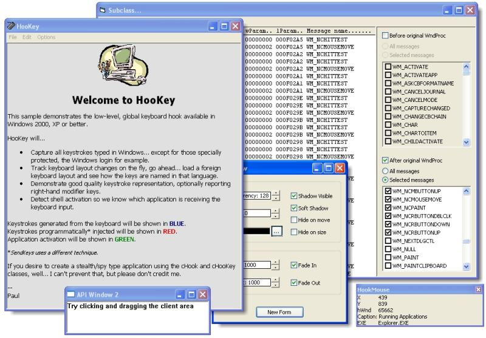



## WinSubHook2 Thunks \- updated 2/13

### Description

Version 2 of my funky thunks. Teaser: check out the global keyboard hook sample as the basis of a spy app... with active app tracking. Update 2/13 minor enhancement to cTimer.cls
 
### More Info
 

             |
---                |---
**Submitted On**   |2004-02-10 14:16:04
**By**             |[Paul Caton](https://github.com/Planet-Source-Code/PSCIndex/blob/master/ByAuthor/paul-caton.md)
**Level**          |Advanced
**User Rating**    |4.9 (200 globes from 41 users)
**Compatibility**  |VB 5\.0, VB 6\.0
**Category**       |[Miscellaneous](https://github.com/Planet-Source-Code/PSCIndex/blob/master/ByCategory/miscellaneous__1-1.md)
**World**          |[Visual Basic](https://github.com/Planet-Source-Code/PSCIndex/blob/master/ByWorld/visual-basic.md)
**Archive File**   |[WinSubHook1708152132004\.zip](https://github.com/Planet-Source-Code/paul-caton-winsubhook2-thunks-updated-2-13__1-51403/archive/master.zip)

